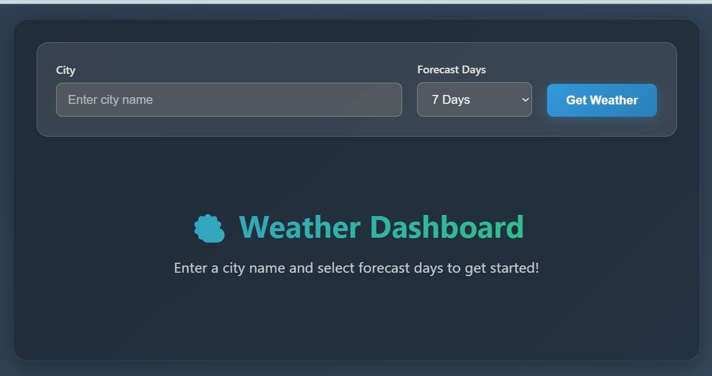
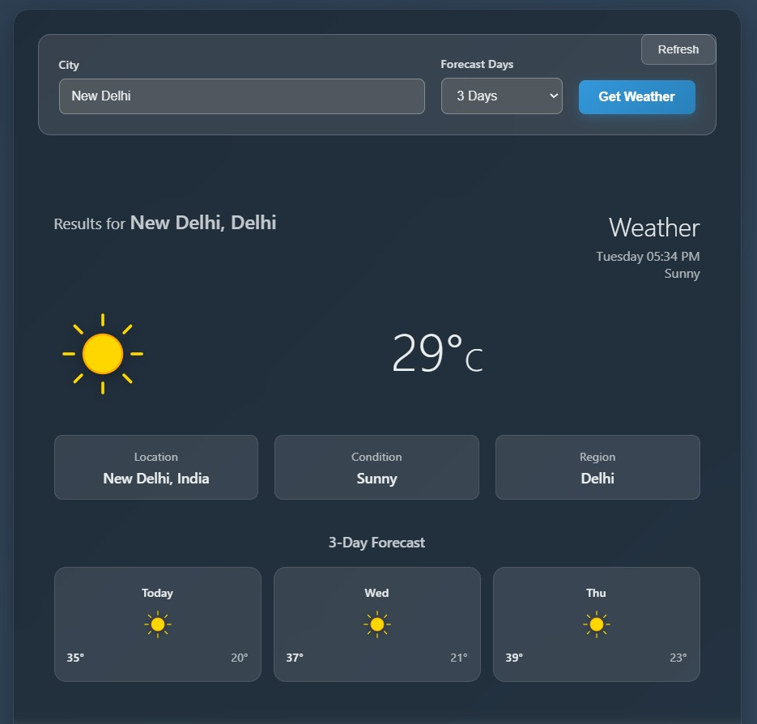

<h1>SpringBoot Weateher Application</h1>
<b>
<or>
<li>Built a Weather Application to display real-time weather information for any city.</li>
<li>Developed using Spring Boot to create RESTful APIs for weather data.</li>
<li>Integrated with an external weather API to fetch current weather and forecast details.</li>
<li>Implemented a layered architecture (Controller → Service → DTO) for clean code structure.</li>
<li>Used Maven for dependency management and project build.</li>
<li>Enabled CORS support to allow frontend applications to access the APIs.</li>
<li>Displays important weather details like temperature, humidity, and weather conditions.</li>
</or>
</b> 
 <h2> Tech Stack </h2>
<b>Java | Spring Boot | REST API | Maven | External Weather API </b> 

# That's all 🎊🎉  

## ScreenShots
   
   
